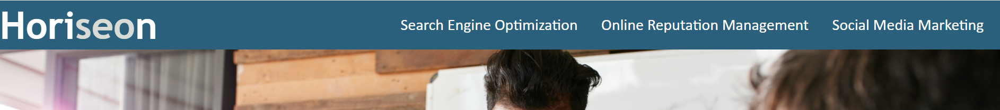
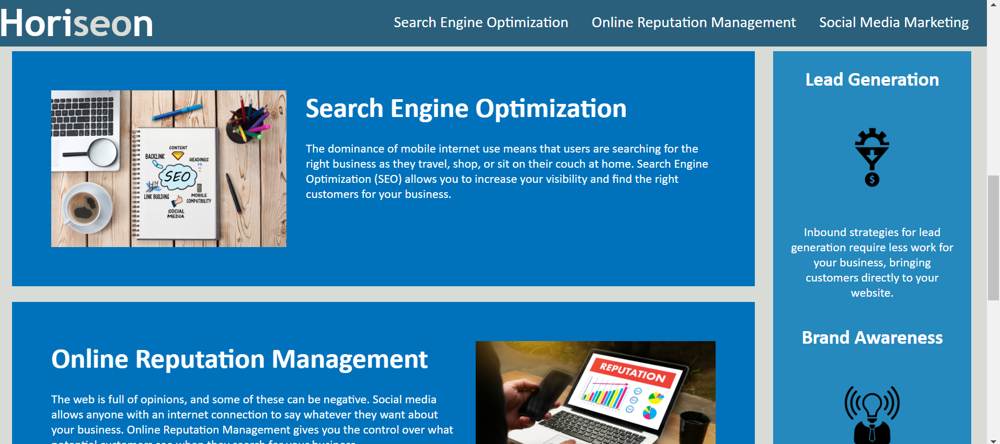

# Homework-01

## Description

* I wanted to edit the source code for **Horiseon's** landing page to be more accessible for screen readers, etc.

* You should find many semantic elements in the **HTML** code establishing a semantic flow and making it easier to identify where and what a given element represents, including alternative image text, a cool favicon, and a fixed nav bar to help navigate the page

* It was a challenge to convert all of the div elements to something more descriptive, then track down the relevant selectors in **_CSS_** and edit them so the **HTML** code and **_CSS_** styles could interact properly

* With this in mind, I've learned that it is important and **much** easier to simply include semantic **HTML** elements when initially writing your code so that you don't need to change everything after your site is up and running

* In the future I'd like to implement some forms to contact **Horiseon** and links to more of their services

## Table of Contents
[Installation](#installation)
[Usage](#usage)
[Credits](#credits)
[License](#license)

## Installation

Follow these steps to create a local copy of this repository so you can edit too!
1. Navigate to https://github.com/stevecarofano/Homework-01
    
2. Find the green **Code** button on the right-hand side, click it and copy the repository URL with HTTPS or SSH keys
    
3. Open the command line or terminal on your machine and navigate to the destination you want the files to live in
    
4. Type git clone _pasteURLhere_
    
5. Hit Enter
    
6. Congratulations! You now have a local copy of this repository and you can make your own changes to it!

## Usage

There isn't much meat on this webpage yet, but you can use the nav bar at the top of the page to jump-to any section of the page and read more about **Horiseon**

Find the nav bar at the top of the page:
    
    
Then click any of the nav links to jump-to that section of the webpage!

Let's click the "Search Engine Optimization" link and see where it takes us
    
    
As you can see we are now at the section of the page containing information about **Horiseon's** search engine optimization

Use any of the links in the nav bar to jump-to your desired content!

## Credits
This was a solo project but I found some helpful resources online

[w3schools HTML semantics](https://www.w3schools.com/html/html5_semantic_elements.asp)

[w3schools CSS selectors](https://www.w3schools.com/cssref/css_selectors.asp)

## License 

MIT License

Copyright (c) [2021] [stevecarofano]

Permission is hereby granted, free of charge, to any person obtaining a copy
of this software and associated documentation files (the "Software"), to deal
in the Software without restriction, including without limitation the rights
to use, copy, modify, merge, publish, distribute, sublicense, and/or sell
copies of the Software, and to permit persons to whom the Software is
furnished to do so, subject to the following conditions:

The above copyright notice and this permission notice shall be included in all
copies or substantial portions of the Software.

THE SOFTWARE IS PROVIDED "AS IS", WITHOUT WARRANTY OF ANY KIND, EXPRESS OR
IMPLIED, INCLUDING BUT NOT LIMITED TO THE WARRANTIES OF MERCHANTABILITY,
FITNESS FOR A PARTICULAR PURPOSE AND NONINFRINGEMENT. IN NO EVENT SHALL THE
AUTHORS OR COPYRIGHT HOLDERS BE LIABLE FOR ANY CLAIM, DAMAGES OR OTHER
LIABILITY, WHETHER IN AN ACTION OF CONTRACT, TORT OR OTHERWISE, ARISING FROM,
OUT OF OR IN CONNECTION WITH THE SOFTWARE OR THE USE OR OTHER DEALINGS IN THE
SOFTWARE.

